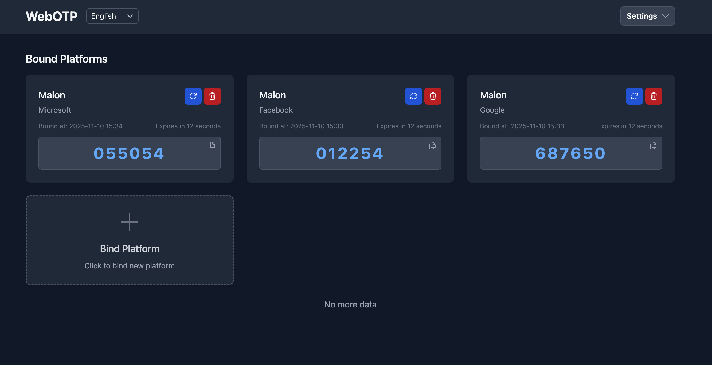

# WebOTP

A web application for managing OTP (One-Time Password). The system consists of a NestJS backend API and a React frontend interface with internationalization support.

## 🌟 Features

- **User Authentication**
    - Secure JWT-based authentication
- **Platform Management**
    - Create and manage authentication platforms
    - Associate user accounts with platforms
- **Internationalization**
    - Multi-language support (English, Simplified Chinese, Traditional Chinese)
    - Language switching capability
- **Modern UI**
    - Responsive dashboard interface
    - Theme support

## 🛠 Tech Stack

### Backend (apps/api)
- **Framework**: NestJS 11
- **Database**: Prisma .prisma with Sqlite
- **Authentication**: JWT, Passport.js, speakeasy (OTP)
- **Validation**: class-validator, class-transformer
- **Testing**: Jest, Supertest
- **Other**: i18n, Helmet security headers

### Frontend (apps/web)
- **Framework**: React 19
- **State Management**: Zustand
- **Styling**: Tailwind CSS, Headless UI
- **Routing**: React Router 7
- **i18n**: i18next
- **HTTP Client**: Axios
- **Build Tool**: Vite

### Shared
- TypeScript
- Monorepo structure (pnpm workspace)
- ESLint + Prettier
- Jest for testing

## 🐳 Usage(Docker Container)

**Quick Start**
```bash
# Run with Docker Compose (recommended):
cd docker && docker compose -f docker-compose.yaml up -d
```

```bash
# Alternative Run with Docker:
docker run -d --name web-otp \
  -e ENCRYPTION_KEY=abcdefghijklmnopqrstuvwxyz123456 \
  -e JWT_SECRET=web_otp_secret_key \
  -e JWT_REFRESH_SECRET=web_otp_refresh_secret_key \
  -p 8080:8080 \
  -v $(pwd)/data:/root/.otp \
  ghcr.io/malonzhao/web-otp:latest
```

Open a browser and visit http://localhost:8080 to use the application.

**Additional Environment Variables**
```dotenv
# 32-byte encryption key for encrypting sensitive OTP data
# DO NOT use default key in production - must be changed and kept secure
ENCRYPTION_KEY=abcdefghijklmnopqrstuvwxyz123456

# Secret key used for signing JWT access tokens
# Unique value required in production - should be 32+ characters
JWT_SECRET=web_otp_secret_key

# Secret key for signing JWT refresh tokens
# Must be different from JWT_SECRET for security
JWT_REFRESH_SECRET=web_otp_refresh_secret_key

# Access token expiration time in seconds
# 3600s = 1 hour, adjust based on security requirements
JWT_EXPIRES_IN=1800s

# Database connection string in Prisma format for sqlite
DATABASE_URL=file:${HOME}/.otp/otp.db
```

## 🚀 Development

### Prerequisites
- Node.js v22+
- pnpm v10+

### Setup
1. Install dependencies:
```bash
pnpm install
```

2. Generate prisma ORM files
```bash
pnpm -F @web-otp/api prisma:generate
```

3. Set up environment variables:
```bash
cp apps/api/.env.example apps/api/.env
# Edit .env with your database connection
```

4. Run database migrations:
```bash
pnpm -F @web-otp/api db:migrate
```

5. Execute seed data population:
```bash
pnpm -F @web-otp/api db:seed
```

## 🏃‍♂️ Running the Application

Start both services in separate terminals:

```bash
pnpm dev
```

The application will be available at:
- API: `http://localhost:3000`
- Web: `http://localhost:5173`

Default account credentials: `admin` / `admin123`

## 🧪 Testing

Run tests for specific applications:

```bash
# Backend tests
pnpm --filter @web-otp/api test

# Frontend tests
pnpm --filter @web-otp/web test
```

## 🤝 Contributing

Contributions are welcome! Please follow these steps:
1. Fork the repository
2. Create your feature branch (`git checkout -b feature/AmazingFeature`)
3. Commit your changes (`git commit -m 'feat: Add some AmazingFeature'`)
4. Push to the branch (`git push origin feature/AmazingFeature`)
5. Open a Pull Request

## 📄 License

This project is licensed under the MIT License - see the [LICENSE](LICENSE) file for details.
